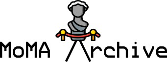

<h1 align="center"></h1>

## Description

An attempt to build Museum of Modern Art's dataset from scratch ([*without inventing the universe*](http://www.youtube.com/watch?v=7s664NsLeFM) )

## Install

```sh
$ curl -OL https://raw.githubusercontent.com/CodeDotJS/MoMArchive/master/collection.py
```

__Upcoming__:

I'm currently working on it to further extend the dataset, but it heavily relies on the data grabbed through `collection.py`

```sh
$ curl -OL https://raw.githubusercontent.com/CodeDotJS/MoMArchive/master/collectionExtended.py
```

## Usage

```sh
$ python extractor.py

Get data from page: x
Get data till page: n
```

__Till where should I scrape the page?__

If you visit MoMA's [collection](https://www.moma.org/collection/), you can see -

- > *Showing 88,144 __(N)__ out of 101,777 works online*

Each page shows 48 works, and if there `"N"` works online, you can do `math.ceil(N/48)` to get to the last page.

__How do I make it fast?__

- You can change the concurrent request limit at [line 92]()


__How is the data organized?__

- The script scrapes and saves random pages as "`Page_<X-N>_moma_collection.json`" to handle concurrent requests.
- Files are then merged into a single, organized "`collection.json`" file.
- By default, the script deletes the intermediate pages, keeping only the main collection file, but you can keep all the pages by commenting out the last four lines of code.

## Structure

The final collection consists of an object with multiple properties (pages), "1", "2", "3", and so on. Each property contains an array with a single object.

```json
{
    "1": [
        {
            "Artist": "Fernando Laposse",
            "Title": "Totomoxtle",
            "Year": "2017",
            "ObjectID": "442508",
            "Work": "https://www.moma.org/collection/works/442508",
            "Thumbnail": "https://www.moma.org/media/W1siZiIsIjU0MjIwOCJdLFsicCIsImNvbnZlcnQiLCItcXVhbGl0eSA5MCAtcmVzaXplIDUxMng1MTJcdTAwM2UiXV0.jpg?sha=36de6710c994ec55"
        }
	],
    "1837": [
        {
            "Artist": "Unidentified photographer",
            "Title": "Untitled",
            "Year": "n.d.",
            "ObjectID": "111535",
            "Work": "https://www.moma.org/collection/works/111535",
            "Thumbnail": "https://www.moma.org/media/W1siZiIsIjM0OTc2MSJdLFsicCIsImNvbnZlcnQiLCItcXVhbGl0eSA5MCAtcmVzaXplIDUxMng1MTJcdTAwM2UiXV0.jpg?sha=4ca080fd135dc4f0"
        }
    ]
}
```

## License

MIT
